# Vitta Sequence Diagrams

PlantUML diagrams for key user flows in Vitta.

---

## 1. Add Credit Card (Plaid Integration)

```plantuml
@startuml add-card-flow
!theme plain
title Add Credit Card - Plaid Integration

actor User
participant "Vitta UI\n(Frontend)" as UI
participant "Plaid SDK" as Plaid
participant "Plaid Backend" as PlaidBackend
participant "Vitta API\n(Backend)" as API
participant "Supabase\n(Database)" as DB
participant "User's Bank\n(Chase)" as Bank

User -> UI: Click "Add Card"
activate UI
UI -> Plaid: Initialize Plaid Link Modal\n(clientName, user, language)
activate Plaid
Plaid -> User: Show Bank Selection Screen
User -> Plaid: Select "Chase"
Plaid -> Plaid: Redirect to Chase Login
User -> Bank: Enter Chase Credentials
activate Bank
Bank -> PlaidBackend: Authenticate User
PlaidBackend -> PlaidBackend: Verify Credentials
Bank <-- PlaidBackend: Authentication Success
deactivate Bank

Plaid -> PlaidBackend: Request Account Tokens
activate PlaidBackend
PlaidBackend -> Plaid: Return Public Token
deactivate PlaidBackend

Plaid -> Plaid: Generate Public Token
Plaid -> UI: Return Public Token\n(via onSuccess callback)
deactivate Plaid

UI -> UI: Capture Public Token
UI -> API: POST /api/cards/add\n{\n  publicToken: "public-xxx",\n  metadata: { bankName: "Chase" }\n}
activate API

API -> PlaidBackend: Exchange Public Token\n→ Access Token
activate PlaidBackend
PlaidBackend -> PlaidBackend: Validate Token
PlaidBackend -> PlaidBackend: Generate Access Token
PlaidBackend -> API: Return Access Token\n(valid for institution)
deactivate PlaidBackend

API -> PlaidBackend: Request Card Details\n(using Access Token)
activate PlaidBackend
PlaidBackend -> Bank: Fetch Card Info\n(number, expiry, limit, APR)
Bank -> PlaidBackend: Card Data
PlaidBackend -> API: Return Card Details\n(masked last 4 digits)
deactivate PlaidBackend

API -> API: Encrypt Card Data\n(AES-256)
API -> DB: INSERT into credit_cards\n{\n  user_id: "123",\n  last_four: "4242",\n  brand: "Visa",\n  expiry_month: 12,\n  expiry_year: 2027,\n  limit: 25000,\n  balance: 8500,\n  apr: 18.5,\n  encrypted_data: "...",\n  created_at: now()\n}
activate DB
DB -> DB: RLS Policy: Verify user_id matches session
DB -> API: Card Inserted ✅\n(id: "card-xyz-123")
deactivate DB

API -> API: Generate Response Object
API -> UI: 200 OK\n{\n  success: true,\n  cardId: "card-xyz-123",\n  card: {\n    brand: "Visa",\n    lastFour: "4242",\n    expiryMonth: 12,\n    expiryYear: 2027,\n    limit: 25000,\n    balance: 8500,\n    apr: 18.5\n  }\n}
deactivate API

UI -> UI: Update Local State:\n- Add card to cardList array\n- Close Plaid modal\n- Refresh Dashboard\nUI -> User: ✅ Display Success Message\n"Chase Visa added successfully!\nBalance: $8,500 | Limit: $25,000"
deactivate UI

Note over User: Card now appears in wallet\nwith real-time balance

@enduml
```



---

## 2A. Send Money to India - Part 1: Intent Recognition & Rate Quote

```plantuml
@startuml send-money-india-part1
!theme plain
title Send Money to India - Part 1: Intent Recognition & Rate Quote

actor User
participant "Vitta Chat UI" as ChatUI
participant "Intent Classifier" as Classifier
participant "Entity Extractor" as EntityExt
participant "Vitta API" as API
participant "Chimoney API" as Chimoney
participant "Supabase" as DB

User -> ChatUI: Type Message:\n"Send $500 to my family in India"
activate ChatUI

ChatUI -> Classifier: processMessage(query)
activate Classifier
Classifier -> Classifier: Tokenize & Analyze\n(compromise.js local NLP)
Classifier -> Classifier: Check pgvector Embeddings\n(vector similarity search)
alt High Confidence Match (≥85%)
  Classifier -> ChatUI: intent = "send_money_international"
  Classifier -> ChatUI: confidence = 0.92
else Medium Confidence (70-84%)
  Classifier -> ChatUI: Fallback to OpenAI GPT
end
deactivate Classifier

ChatUI -> EntityExt: extractEntities(query, intent)
activate EntityExt
EntityExt -> EntityExt: Extract Amount: $500\nDestination: India\nPayment Type: international_transfer
EntityExt -> ChatUI: {\n  amount: 500,\n  currency: "USD",\n  destination: "India",\n  recipient_type: "family"\n}
deactivate EntityExt

ChatUI -> API: GET /api/transfers/quote\n{\n  amount: 500,\n  from_currency: "USD",\n  to_currency: "INR",\n  payment_method: "upi"\n}
activate API

API -> Chimoney: GET /v1/fxrate/quote\n{\n  amount: 500,\n  from: "USD",\n  to: "INR"\n}
activate Chimoney
Chimoney -> Chimoney: Calculate Real-Time FX Rate\nCurrent Rate: 1 USD = 83.50 INR
Chimoney -> API: {\n  rate: 83.50,\n  amount_in_inr: 41750,\n  fee_usd: 2.50,\n  final_amount: 41722.50,\n  quote_valid_until: now() + 5min\n}
deactivate Chimoney

API -> DB: INSERT into transfer_requests\n{\n  user_id: "123",\n  status: "draft",\n  amount: 500,\n  fx_rate: 83.50,\n  created_at: now()\n}
activate DB
DB -> API: transfer_id = "txn-abc-123"
deactivate DB

API -> ChatUI: {\n  transferId: "txn-abc-123",\n  amount: 500,\n  rateUsd: 83.50,\n  amountInr: 41750,\n  feeUsd: 2.50,\n  finalAmount: 41722.50,\n  quoteValidUntil: "2024-02-19T10:20:00Z",\n  last24HourMin: 83.25,\n  last24HourMax: 84.10\n}
deactivate API

ChatUI -> User: 📊 Display Rate Quote\n┌─────────────────────┐\n│ Sending: $500       │\n│ Rate: 1 USD = ₹83.50│\n│ You Get: ₹41,722.50 │\n│ Fee: $2.50          │\n│ Valid for: 5 min    │\n│ 24-hr Range:        │\n│   Min: ₹83.25       │\n│   Max: ₹84.10       │\n│ ┌─ Lock Rate        │\n│ └─ Cancel           │\n└─────────────────────┘

User -> ChatUI: Click "Lock Rate"

ChatUI -> API: POST /api/transfers/lock-rate\n{\n  transferId: "txn-abc-123"\n}
activate API

API -> DB: UPDATE transfer_requests\nSET status = "rate_locked",\n    locked_rate = 83.50,\n    locked_until = now() + 5min
DB -> API: ✅ Rate Locked
deactivate DB

API -> ChatUI: {\n  status: "rate_locked",\n  lockedUntil: "2024-02-19T10:20:00Z"\n}
deactivate API

ChatUI -> User: ✅ "Rate locked for 5 minutes!\nNow tell me who receives this in India?"
deactivate ChatUI

@enduml
```



---

## 2B. Send Money to India - Part 2: Recipient Verification & Payment Execution

```plantuml
@startuml send-money-india-part2
!theme plain
title Send Money to India - Part 2: Recipient Verification & Payment

actor User
participant "Vitta Chat UI" as ChatUI
participant "Entity Extractor" as EntityExt
participant "Vitta API" as API
participant "Chimoney API" as Chimoney
participant "Supabase" as DB
participant "User's Device" as Device

User -> ChatUI: Reply:\n"Send to Amit Kumar, his number is +91-9876543210"
activate ChatUI

ChatUI -> EntityExt: extractRecipientInfo(message)
activate EntityExt
EntityExt -> ChatUI: {\n  recipientName: "Amit Kumar",\n  recipientPhone: "+91-9876543210",\n  paymentMethod: "upi"\n}
deactivate EntityExt

ChatUI -> API: POST /api/transfers/recipients/add\n{\n  name: "Amit Kumar",\n  phone: "+91-9876543210",\n  payment_method: "upi"\n}
activate API

API -> API: Validate Phone Format\n✅ +91-9876543210 valid

API -> Chimoney: POST /v1/recipients/verify\n{\n  name: "Amit Kumar",\n  phone: "+91-9876543210",\n  payment_method: "upi"\n}
activate Chimoney
Chimoney -> Chimoney: Validate Recipient Details\n✅ Phone format valid\n✅ Account accessible
Chimoney -> API: {\n  verified: true,\n  recipient_id: "chim_rec_xyz123",\n  account_type: "upi",\n  account_valid: true\n}
deactivate Chimoney

API -> DB: INSERT into recipients\n{\n  user_id: "123",\n  name: "Amit Kumar",\n  phone: "+91-9876543210",\n  payment_method: "upi",\n  chimoney_recipient_id: "chim_rec_xyz123",\n  verification_status: "verified",\n  verified_at: now()\n}
activate DB
DB -> DB: RLS Policy: Verify user_id matches session
DB -> API: ✅ Recipient Saved\n(id: "rec-db-789")
deactivate DB

API -> ChatUI: {\n  recipientId: "rec-db-789",\n  recipientName: "Amit Kumar",\n  chimoney_recipient_id: "chim_rec_xyz123",\n  verified: true\n}
deactivate API

ChatUI -> User: ✅ "Recipient verified and saved!\n\nTransfer Summary:\n━━━━━━━━━━━━━━━━━\nTo: Amit Kumar\nNumber: +91-9876543210\nMethod: UPI\nAmount: ₹41,722.50\nFee: $2.50\nTime: 2-5 minutes\n━━━━━━━━━━━━━━━━━\n[Send Now] [Cancel]"

User -> ChatUI: Click "Send Now"

ChatUI -> API: POST /api/transfers/immediate\n{\n  transferId: "txn-abc-123",\n  recipientId: "rec-db-789",\n  Idempotency-Key: "user-123-transfer-txn-abc-123-1708323600000"\n}
activate API

API -> API: Validate Idempotency-Key\n✅ Not seen before
API -> DB: Check transfer status = "rate_locked"
DB -> API: ✅ Status confirmed

API -> Chimoney: POST /v1/transfer/initiate\n{\n  amount: 500,\n  from_currency: "USD",\n  to_currency: "INR",\n  recipient_id: "chim_rec_xyz123",\n  payment_method: "upi",\n  X-Idempotency-Key: "chimoney-txn-abc-123-001"\n}
activate Chimoney

Chimoney -> Chimoney: Validate Recipient\nValidate Amount\nValidate Rate Lock\n✅ All OK\nInitiate UPI Payment

Chimoney -> API: {\n  status: "payment_initiated",\n  transaction_id: "chi-txn-999",\n  settlement_time_estimate: "2-5 minutes"\n}
deactivate Chimoney

API -> DB: UPDATE transfers\nSET status = "payment_initiated",\n    chimoney_transaction_id = "chi-txn-999",\n    payment_initiated_at = now()

DB -> API: ✅ Transfer Recorded
deactivate DB

API -> ChatUI: {\n  success: true,\n  status: "payment_initiated",\n  trackingId: "chi-txn-999"\n}
deactivate API

ChatUI -> User: ✅ "Payment Sent!\n\n🎯 ₹41,722.50 → Amit Kumar\n📱 Via UPI\n⏱️ Arriving in 2-5 minutes\n🔗 Track: chi-txn-999"

par Background Webhook
  Chimoney -> API: POST /api/webhooks/chimoney\n{\n  event: "transfer.completed",\n  transaction_id: "chi-txn-999",\n  status: "settled"\n}
  activate API
  API -> DB: UPDATE transfers\n  SET status = "completed"
  DB -> API: ✅ Done
  deactivate API
end

Device -> User: 📱 SMS Notification\n"Transfer complete! ₹41,722.50\nto Amit Kumar. Ref: chi-txn-999"

ChatUI -> User: 🔔 "✅ Delivered!\n₹41,722.50 received by\nAmit Kumar"
deactivate ChatUI

@enduml
```



---

## 3. Rate-Triggered Transfer (Autonomous Agent)

```plantuml
@startuml rate-triggered-transfer
!theme plain
title Rate-Triggered Transfer - Autonomous Agent Execution

actor User
participant "Vitta UI" as UI
participant "Chat Interface" as Chat
participant "Vitta API" as API
participant "Supabase DB" as DB
participant "Cron Job\n(15-min polling)" as Cron
participant "Chimoney API" as Chimoney

User -> Chat: "Send $500 to India\nwhen rate drops below 83.5"
activate Chat

Chat -> Chat: Intent Recognition\n→ "rate_triggered_transfer"
Chat -> Chat: Extract Entities\nAmount: $500\nTarget Rate: 83.5\nDestination: India

Chat -> API: POST /api/transfers/rate-triggered\n{\n  amount: 500,\n  targetRate: 83.5,\n  recipientId: "rec-xyz-789"\n}
activate API

API -> Chimoney: GET /v1/fxrate/quote\n{\n  amount: 500,\n  from: "USD",\n  to: "INR"\n}
activate Chimoney
Chimoney -> API: Current Rate: 83.75\n(above target 83.5)
deactivate Chimoney

API -> DB: INSERT into transfers\n{\n  user_id: "123",\n  status: "monitoring",\n  amount: 500,\n  target_rate: 83.5,\n  current_rate: 83.75,\n  recipient_id: "rec-xyz-789",\n  monitoring_started_at: now(),\n  metadata: { auto_execute: true }\n}
DB -> API: transfer_id = "txn-monitor-456"
deactivate DB

API -> Chat: {\n  transferId: "txn-monitor-456",\n  status: "monitoring",\n  currentRate: 83.75,\n  targetRate: 83.5,\n  message: "Watching rate. I'll send when it reaches 83.5 or lower."\n}

Chat -> UI: 👀 "Monitoring USD/INR rate\nTarget: 83.5 or lower\nCurrent: 83.75\nI'll notify you when ready to send!"
deactivate Chat

par Every 15 Minutes (Background Job)
  loop Every 15 Minutes
    Cron -> DB: SELECT all transfers\n  WHERE status = "monitoring"\n  AND current_date = today()
    activate DB
    DB -> Cron: Return transfers to monitor\n  (e.g., "txn-monitor-456")\n  [\n    { id: "txn-monitor-456",\n      target_rate: 83.5,\n      recipient: "rec-xyz-789"\n    }\n  ]
    deactivate DB

    Cron -> Chimoney: GET /v1/fxrate/quote\n{\n  amount: 500,\n  from: "USD",\n  to: "INR"\n}
    activate Chimoney

    alt Rate NOT reached (e.g., 83.62)
      Chimoney -> Cron: Current Rate: 83.62
      Cron -> DB: UPDATE transfers\n  SET current_rate = 83.62,\n  last_checked_at = now()\n      WHERE id = "txn-monitor-456"
      activate DB
      DB -> Cron: ✅ Updated
      deactivate DB
      Cron -> Cron: Continue monitoring...\n(next check in 15 min)

    else Rate REACHED! (e.g., 83.42)
      Chimoney -> Cron: Current Rate: 83.42\n✅ BELOW TARGET 83.5!
      deactivate Chimoney

      Cron -> Cron: 🎯 TRIGGER AUTO-EXECUTION
      Cron -> API: POST /api/transfers/auto-execute\n{\n  transferId: "txn-monitor-456",\n  currentRate: 83.42,\n  auto_trigger: true\n}
      activate API

      API -> DB: UPDATE transfers\n  SET status = "rate_met",\n  met_rate = 83.42,\n  rate_met_at = now()
      activate DB
      DB -> API: ✅ Status Changed
      deactivate DB

      API -> DB: INSERT into transfer_requests\n  (prepare for payment)\n{\n  transfer_id: "txn-monitor-456",\n  user_id: "123",\n  idempotency_key: "auto-exec-456-001",\n  status: "pending"\n}
      DB -> API: ✅ Ready
      deactivate DB

      API -> Chimoney: POST /v1/transfer/initiate\n{\n  transfer_id: "txn-monitor-456",\n  amount: 500,\n  rate: 83.42,\n  recipient_id: "rec-xyz-789",\n  payment_method: "upi",\n  X-Idempotency-Key: "auto-exec-456-001"\n}
      activate Chimoney
      Chimoney -> Chimoney: EXECUTE TRANSFER\n✅ Payment Initiated
      Chimoney -> API: {\n        status: "payment_initiated",\n        transaction_id: "chi-auto-500",\n        settlement_time: "2-5 minutes"\n      }
      deactivate Chimoney

      API -> DB: UPDATE transfers\n  SET status = "payment_initiated",\n  chimoney_transaction_id = "chi-auto-500"\n      DB -> API: ✅ Recorded
      deactivate DB

      API -> Cron: {\n        success: true,\n        message: "Payment auto-executed!\"\n      }
      deactivate API

      Cron -> Chat: Trigger Notification

      Chat -> UI: 🎯 NOTIFICATION BANNER\n┌────────────────────────────┐\n│ 🎯 Rate Target Met!        │\n│ ✅ Transfer Auto-Executed  │\n│ ━━━━━━━━━━━━━━━━━━━━━━━━  │\n│ Amount: $500 USD           │\n│ Rate: 1 USD = ₹83.42      │\n│ You Get: ₹41,710           │\n│ To: Amit Kumar (+91...)     │\n│ Status: Payment Initiated   │\n│ Time: 2-5 minutes          │\n│ ✅ [View Details]          │\n└────────────────────────────┘

      Chat -> User: 🔔 "Your transfer is on the way!\n\nRate target met (83.42)!\n$500 sent to Amit Kumar via UPI.\nShould arrive in 2-5 minutes.\n\nReference: chi-auto-500"

      Note over UI: User receives SMS too:\n"Transfer sent! $500 USD → ₹41,710\nto +91-9876543210. Ref: chi-auto-500"
    end
  end
end

par Background: Payment Settlement
  Chimoney -> API: POST /api/webhooks/chimoney\n{\n  event: "transfer.completed",\n  transaction_id: "chi-auto-500",\n  status: "settled",\n  timestamp: now() - 3min\n}
  activate API
  API -> DB: UPDATE transfers\n  SET status = "completed"\n  DB -> API: ✅ Done
  deactivate DB
  deactivate API
end

UI -> User: ✅ FINAL NOTIFICATION\n"Delivered! Amit Kumar received ₹41,710"

@enduml
```



---

## How to Use These Diagrams

### Option 1: View Online
1. Go to [PlantUML Online Editor](https://www.plantuml.com/plantuml/uml/)
2. Copy the code block (between `` ``` ``)
3. Paste into the editor
4. Diagrams render automatically

### Option 2: Embed in GitHub
Use this format in your Markdown:

```markdown

```

### Option 3: Generate PNG/SVG Locally
```bash
# Install PlantUML
brew install plantuml

# Generate PNG
plantuml -Tpng SEQUENCE_DIAGRAMS.md -o diagrams/

# Generate SVG (better quality)
plantuml -Tsvg SEQUENCE_DIAGRAMS.md -o diagrams/
```

### Option 4: Use in VS Code
- Install "PlantUML" extension by jebbs
- Open `.puml` file
- Right-click → "PlantUML: Preview Current Diagram"

---

## Key Elements Explained

### Diagram 1: Add Card
- **Actors**: User, Frontend, Plaid SDK, Backend, Supabase, Chase Bank
- **Key Flows**:
  1. Plaid Link opens securely
  2. User authenticates with Chase
  3. Public token returned to frontend
  4. Backend exchanges for access token
  5. Card data encrypted and stored
  6. Real-time balance & APR synced

### Diagram 2A: Send Money to India - Part 1 (Intent Recognition & Rate Quote)
- **Actors**: User, Chat, Intent Classifier, APIs, Chimoney, Supabase
- **Key Flows**:
  1. Intent recognition ("send money international")
  2. Entity extraction (amount $500, destination India)
  3. FX rate quote from Chimoney API (real-time rates)
  4. Display rate quote to user with 5-minute validity
  5. User locks rate for the transfer
  6. Rate locked in database for guaranteed execution

### Diagram 2B: Send Money to India - Part 2 (Recipient Verification & Payment)
- **Actors**: User, Chat, APIs, Chimoney, Supabase, Device
- **Key Flows**:
  1. Entity extraction (recipient name, phone)
  2. **Recipient verification via Chimoney API** (server-side, no OTP)
  3. Recipient stored with Chimoney ID for future reuse
  4. Idempotent payment execution (Idempotency-Key prevents duplicates)
  5. UPI payment initiated via NPCI network
  6. Webhook confirmation from Chimoney
  7. Real-time SMS + in-app notifications

### Diagram 3: Rate-Triggered Transfer
- **Autonomous Agent Behavior**:
  1. User sets target rate (83.5)
  2. Transfer enters "monitoring" status
  3. Every 15 minutes: Check current rate
  4. When rate ≤ 83.5: AUTO-EXECUTE
  5. Payment initiated without user intervention
  6. Real-time notification with results

---

## PlantUML Syntax Quick Reference

```plantuml
@startuml diagram-name
!theme plain

' Actors and Participants
actor User
participant "Component Name" as ComponentAlias
participant "Another Component"

' Messages
User -> ComponentAlias: Message Text
ComponentAlias -> User: Response Text

' Activation Box (shows component is active)
activate ComponentAlias
... messages ...
deactivate ComponentAlias

' Alternative Flows
alt Condition A
  message 1
else Condition B
  message 2
end

' Parallel Flows
par Parallel Flow 1
  message
and Parallel Flow 2
  message
end

' Loop
loop Every 15 Minutes
  message
end

' Notes
Note over Component: This is a note

' Grouping
group Process Name
  messages
end

@enduml
```

---

## Customization Examples

### Add Colors
```plantuml
participant "Chimoney API" as Chimoney #FFD700
participant "Supabase" as DB #00BFFF
```

### Add Timing
```plantuml
User -> API: Request\n(takes ~200ms)
```

### Add Fragment Types
```plantuml
alt Authentication Success
  API -> DB: Save Token
else Authentication Failed
  API -> User: Show Error
end
```

---

## Integration with README

You can reference these diagrams in your README:

```markdown
## System Flows

### User Journey 1: Adding a Card
See [Add Card Sequence Diagram](docs/SEQUENCE_DIAGRAMS.md#1-add-credit-card-plaid-integration)

### User Journey 2: Sending Money to India
See [Send Money Sequence Diagram](docs/SEQUENCE_DIAGRAMS.md#2-send-money-to-india-intent-based-transfer)

### Autonomous Features: Rate-Triggered Transfer
See [Rate-Triggered Sequence Diagram](docs/SEQUENCE_DIAGRAMS.md#3-rate-triggered-transfer-autonomous-agent)
```

---

## Next Steps

1. **Copy the PlantUML code** from any section above
2. **Paste into [PlantUML Online Editor](https://www.plantuml.com/plantuml/uml/)**
3. **Customize** colors, actors, or messages as needed
4. **Export** as PNG/SVG for presentations or documentation
5. **Embed** in GitHub Wiki or Confluence

These diagrams are production-ready for:
- ✅ YC Startup School presentations
- ✅ Neo accelerator applications
- ✅ Technical documentation for developers
- ✅ Architecture review meetings
- ✅ Team onboarding materials
